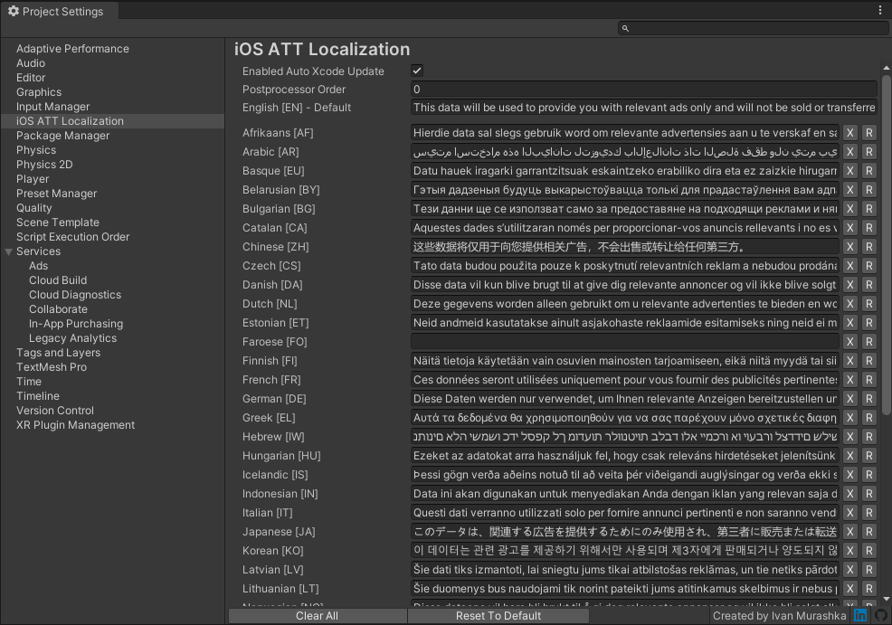

# 📓 iOS App Tracking Transparency Localization for Unity
[](https://openupm.com/packages/com.appegy.ios-att-localization/)

## Description


Provides per-language localization of the iOS App Tracking Transparency (ATT) prompt - the message (`NSUserTrackingUsageDescription`) shown when an app asks permission to track the user. iOS shows the prompt in the device language, so a single English string reads out of place for non-English users (and can draw App Store review attention). Set a description per language and the matching Xcode entries are written on build. Works alongside Unity's official [iOS 14 Advertising Support](https://docs.unity3d.com/Packages/com.unity.ads.ios-support@1.0/manual/index.html) package.

## Installation
Manual add package to the ```manifest.json```.
```
"dependencies": {
  "com.appegy.ios-att-localization": "https://github.com/Appegy/iOS-ATT-Localization.git?path=/src",
  ...
},
```

Or you can specify version you need
```
"dependencies": {
  "com.appegy.ios-att-localization": "https://github.com/Appegy/iOS-ATT-Localization.git?path=/src#1.1.1",
  ...
},
```

Or just use [OpenUPM](https://openupm.com/packages/com.appegy.ios-att-localization/)
```
openupm add com.appegy.ios-att-localization
```

## Project Settings
The easiest way to add translations is just set them up in `Project Settings`.
```
Edit ➜ Project Settings ➜ iOS ATT Localization
```
Xcode project will be automatically updated after build if `Enabled Auto Xcode Update` is checked. You also must specify `English [EN] - Default` description. This description will be applied to `NSUserTrackingUsageDescription` property in main Info.plist. Now  you are ready to set descriptions for any language you need (**leave description empty if you want to use `English [EN] - Default`**).

## API
You also can set translation for any language by code. In your postprocessor script you can use next methods
```C#
public class YourPostProcessor : IPostprocessBuildWithReport
{
    public int callbackOrder => 0;

    public void OnPostprocessBuild(BuildReport report)
    {
        if (report.summary.platform == BuildTarget.iOS)
        {
            var buildPath = report.summary.outputPath;
            
            // Add AppTrackingTransparency.framework to generated xcode project 
            TransparencyDescriptionsAPI.AddAppTrackingTransparencyFramework(buildPath);
            
            // Override NSUserTrackingUsageDescription in main Info.plist
            TransparencyDescriptionsAPI.SetAppTransparencyDefaultDescription(buildPath, "Default translation");
            
            // Set description for specific language
            TransparencyDescriptionsAPI.SetAppTransparencyDescription(buildPath, SystemLanguage.Belarusian, "Жыве Беларусь!");
        }
    }
}
```